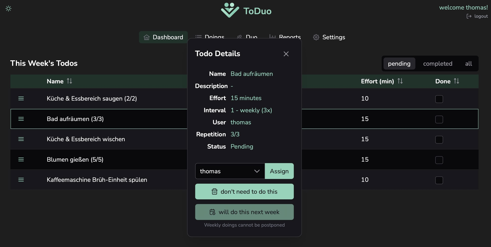
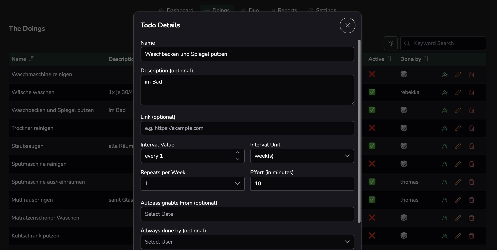

# TuDuo

TuDuo is a collaborative, group-based task and habit management platform designed for teams, duos, families, or partners. It features a modern web frontend and a secure, scalable backend, supporting group-based permissions, recurring assignments, statistics, and more.

## Why TuDuo?

The main reason for this app is to remove the mental load of knowing what to do when, and to enable a less stressful, more fair division of tasks between partners, families, or any group. TuDuo helps you stop worrying about who should do what and when—just log in and see what needs to be done, with assignments distributed automatically.

## Screenshots

| Dashboard | Doings |
|-----------|--------|
|  |  |

---

## Features

- **Group-based Task Management:** Each user belongs to a group, and all data is isolated per group.
- **Recurring Assignments:** Flexible scheduling for recurring tasks/habits ("doings") with intervals and repetition rules.
- **Automatic Assignment:** Smart auto-assignment of tasks to group members. It looks at past behavior and preferences (so called "shitty points") to optimize task distribution.
- **Statistics & Reports:** Aggregated statistics and reports for group performance and participation.
- **API Key Management:** Users with permission can create/roll API keys for integrations.
- **Role-based Permissions:** Fine-grained permissions (e.g., settings access) managed via Auth0.
- **Modern UI:** Responsive, mobile-friendly interface with dark mode, pull-to-refresh, and PrimeVue components.
- **Authentication & Security:** Auth0-based authentication and authorization, TLS support for local and production.


## Tech Stack

### Frontend
- **Framework:** Vue 3
- **UI:** PrimeVue, PrimeIcons, Tailwind CSS (with PrimeVue theme)
- **State Management:** Pinia
- **Routing:** Vue Router
- **Auth:** Auth0 (via @auth0/auth0-vue)
- **Build Tool:** Vite

### Backend
- **Framework:** Elysia (Bun runtime)
- **ORM:** Drizzle ORM
- **Database:** SQLite (per-group DB files)
- **Auth:** Auth0 (JWT validation)
- **Job Scheduling:** Croner
- **API Docs:** Swagger (via @elysiajs/swagger)
- **Static Serving:** @elysiajs/static (serves built frontend)


## Architecture

- **Monorepo:**
  - `/frontend` — Vue 3 SPA (PrimeVue, Tailwind, Vite)
  - `/src` — Bun/Elysia backend (API, DB, Auth, Cron, etc.)
- **Frontend** is built and served as static files by the backend in production.
- **Each group** has its own SQLite database file (auto-created on first login).
- **Auth0** is used for both frontend and backend authentication/authorization.


## Project Structure

```
├── frontend/           # Vue 3 SPA (PrimeVue, Tailwind, Vite)
│   ├── src/
│   ├── public/
│   └── ...
├── src/                # Bun/Elysia backend
│   ├── database/       # Drizzle ORM schema, migrations, seed
│   ├── routes/         # API endpoints
│   ├── utils/          # Helpers, cron jobs, etc.
│   └── ...
├── databases/          # SQLite DB files (per group, auto-created)
├── .env.example        # Example environment variables
├── Dockerfile          # Production build & run
└── ...
```


## Setup & Development

### Prerequisites
- [Bun](https://bun.sh/) (>=1.0)
- [Node.js](https://nodejs.org/) (for some tooling)
- [Auth0 account](https://auth0.com/)

### 1. Clone & Install

```bash
git clone https://github.com/BoThomas/toduo.git
cd toduo
bun install && bun install --cwd ./frontend
```

### 2. Environment Variables

Copy `.env.example` to `.env` and fill in your Auth0 and other config:

```bash
cp .env.example .env
# Edit .env as needed
```

### 3. Development

Start both backend and frontend (concurrently):

```bash
bun run dev
# Backend: https://localhost:3000
# Frontend: https://localhost:5111 (proxied in dev)
```

#### Local TLS (for Auth0)

Generate a self-signed certificate for local HTTPS (required for Auth0):

```bash
mkdir -p tls
openssl req -x509 -out tls/cert.pem -keyout tls/key.pem \
  -newkey rsa:2048 -nodes -sha256 \
  -subj '/CN=localhost' -extensions EXT -config <( \
   printf "[dn]\nCN=localhost\n[req]\ndistinguished_name = dn\n[EXT]\nsubjectAltName=DNS:localhost\nkeyUsage=digitalSignature\nextendedKeyUsage=serverAuth")
```

OR disable web security in Chrome (not recommended for regular use):

```bash
open -n -a /Applications/Google\ Chrome.app/Contents/MacOS/Google\ Chrome --args --user-data-dir="/tmp/chrome_dev_test" --disable-web-security
```

### 4. Build & Production

```bash
bun run build
bun run start
```
or use the [`./Dockerfile`](./Dockerfile).

## API

- All API endpoints are under `/api` and require Auth0 JWT Bearer token.
- See Swagger docs at `/swagger` (when running backend).


## Environment Variables

See `.env.example` for all available configuration options (Auth0, DB, TLS, etc).
